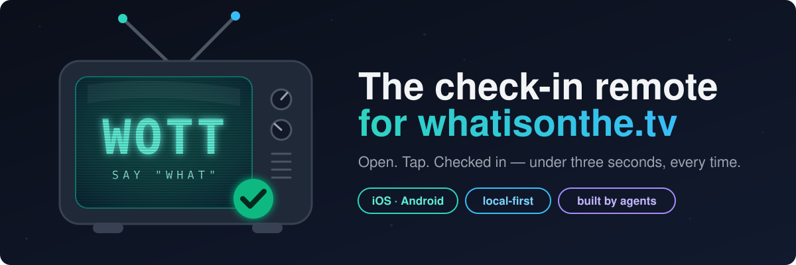

  

  
  
  

# WOTT

**WOTT** (pronounced _"what"_) is a native iOS + Android check-in app — the
mobile companion to [whatisonthe.tv](https://whatisonthe.tv). It does one
thing: you watched something, you tap, it's logged.

Think of it as a **remote control, not a telly guide**. Watchlists, person
pages, stats, and public profiles all stay on the website. The app exists for
the moment the credits roll.

## The problem

Check-ins get skipped because doing them on a phone via the website is too
slow. Every open is: launch a browser view → hydrate SvelteKit → round-trip
to Heroku → maybe a TVDB fallback → _then_ tap. And a PWA doesn't fix it on
iOS — service workers and storage get evicted, so it regularly cold-starts as
a fresh website.

**The bar this app has to clear:** open it and check in to the next episode
of a current show in **under 3 seconds**, on mobile data, every time.

## How it clears it

- **Capacitor wrapping a static SvelteKit build** ([ADR-001](PLAN.md#3-framework-decision-adr-001)) —
  same stack as the website, assets shipped inside the binary, real store
  presence from one codebase.
- **Local-first.** The first frame renders from on-device SQLite. The network
  is never in front of a tap.
- **Optimistic writes.** A check-in is "done" the instant it's tapped; a sync
  queue flushes it to the backend in the background, with retry, and
  idempotency guarantees it can never double-log.
- **Two speed tiers, honestly.** Anything you've watched before is instant.
  Searching for a _new_ show is a network call and may show a spinner — but
  once checked in, it's pulled local and stays instant forever.

The full thinking — architecture, screens, local schema, backend changes —
lives in **[PLAN.md](PLAN.md)**.

## How it's being built

This project is run **plan-first and issue-driven, with the work done
largely by AI agents**:

1. [PLAN.md](PLAN.md) was written and argued over before any code.
2. The plan was decomposed into [GitHub issues](https://github.com/swmcc/wott/issues)
   under [milestones M0–M7](https://github.com/swmcc/wott/milestones), each
   with acceptance criteria and explicit _blocked-by_ links. Backend work
   lives as issues on [whatisonthe.tv](https://github.com/swmcc/whatisonthe.tv/issues)
   and ships independently.
3. Issues are picked up by coding agents (Claude Code). Two docs exist purely
   to make that work: **[API.md](API.md)** — the backend contract, verified
   against the actual FastAPI source, including pinned shapes for endpoints
   that don't exist yet — and **[CLAUDE.md](CLAUDE.md)** — ground rules and
   what agents can't verify.
4. Anything needing a physical device (cold-start stopwatch, TestFlight) is
   done by a human. Agents stop at "ready for device test" and say so.

| Milestone                   | Proves                                                                             |
| --------------------------- | ---------------------------------------------------------------------------------- |
| **M0** · Scaffold           | The toolchain works on real devices                                                |
| **M1** · Backend API        | Continue-watching, refresh tokens, idempotency — ships first, website benefits too |
| **M2** · Walking skeleton   | Login → tap → check-in lands in the prod DB                                        |
| **M3** · Local-first        | "Instant" is real — the stopwatch gate for ADR-001                                 |
| **M4** · Sync queue         | Check in in a dead spot; it syncs later, exactly once                              |
| **M5** · Search & new shows | The full experience                                                                |
| **M6** · Polish             | Icons, haptics, dark mode — feels like an app                                      |
| **M7** · Distribution       | TestFlight + Play internal track                                                   |

## Repo map

| File                   | What it's for                                            |
| ---------------------- | -------------------------------------------------------- |
| [PLAN.md](PLAN.md)     | The product/architecture plan everything traces back to  |
| [API.md](API.md)       | The whatisonthe.tv API contract the app is built against |
| [CLAUDE.md](CLAUDE.md) | Working agreement for the agents building this           |

---

A personal project by <a href="https://github.com/swmcc">@swmcc</a> · backend & website: <a href="https://github.com/swmcc/whatisonthe.tv">whatisonthe.tv</a>

